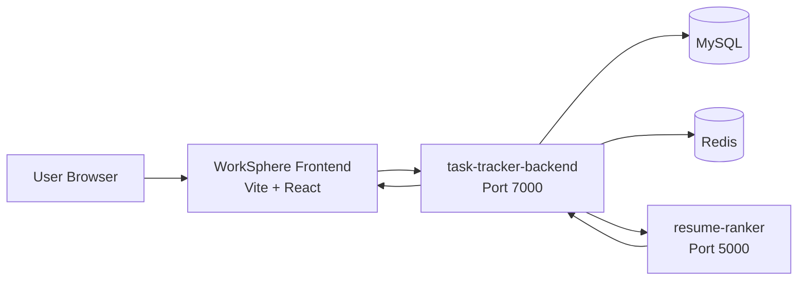

# WorkSphere

WorkSphere is a role-based HRMS and work management platform for teams that need one place to handle projects, tasks, scheduling, chat, leave workflows, regularization, jobs, and system settings.

This repository contains the public homepage and the authenticated frontend for the WorkSphere product. The frontend connects to the `task-tracker-backend` API and the `resume-ranker` service for hiring workflows.

You can run the full stack locally with npm or use Docker Compose from the workspace root.

## What the frontend does

The frontend is built with React, Vite, TailwindCSS, React Router, Framer Motion, Lucide icons, Recharts, FullCalendar, and Socket.IO client support.

The main areas of the app are:

- Public homepage and login entry flow.
- Protected dashboard shell with sidebar and top navigation.
- Project management views for creating, browsing, and inspecting projects.
- Task updates and task assignment flows.
- Team, chat, jobs, calendar, leave, and regularization pages.
- Settings screens for profile, security, billing, integrations, access control, and account deletion.
- RBAC-aware route protection so only permitted users can reach sensitive screens.

### Frontend structure at a glance

- `src/pages/Home.jsx` - public WorkSphere homepage.
- `src/pages/Login.jsx` - sign in and sign up flow.
- `src/layout/RootLayout.jsx` - authenticated app shell.
- `src/layout/Sidebaar.jsx` - main navigation.
- `src/router/ProtectedRoute.jsx` and `src/router/PermissionRoute.jsx` - access control.
- `src/utility/Config.js` - API base URL configuration.

## How the services connect

WorkSphere is designed as a three-part system:



### Frontend to backend

The frontend reads API settings from environment variables in `src/utility/Config.js`.

- `VITE_API_BASE_URL` defaults to `http://127.0.0.1:7000/api`.
- `VITE_CHAT_API_BASE_URL` defaults to the same base unless overridden.

The frontend calls backend routes such as:

- `/api/auth`
- `/api/user`
- `/api/company`
- `/api/projects`
- `/api/dashboard`
- `/api/chats`
- `/api/messages`
- `/api/rbac`
- `/api/holidays`
- `/api/integrations`
- `/api/candidates`
- `/api/jobs`

### Backend to resume-ranker

The backend is configured to forward resume-related work to the `resume-ranker` service.

- `RESUME_RANKER_UPLOAD_URL` points to the upload endpoint on the resume-ranker service.
- `RESUME_RANKER_SCORE_URL` points to the scoring endpoint on the resume-ranker service.
- The resume-ranker service exposes routes for upload, candidates, rank, queue, and score.

That means WorkSphere can keep the recruiting flow inside the HRMS while the resume parsing and ranking work happens in the dedicated service.

## Resume-ranker service

`resume-ranker` is a separate service in this workspace. It is started from `backend/server.js` inside that folder and exposes:

- `POST /upload`
- `GET /candidates`
- `GET /rank`
- `GET /queue`
- `GET /score`

The service is used for resume upload, parsing, candidate extraction, and scoring so the main HRMS app can surface hiring data without doing that processing in the frontend.

## Local development

### Prerequisites

- Node.js 18+ recommended
- npm
- MySQL 8
- Redis 7

### Run with Docker Compose

From the workspace root:

```bash
docker-compose up --build
```

This starts:

- MySQL on `3307`
- Redis on `6379`
- `task-tracker-backend` on `7000`
- `task` frontend on `5173`
- `resume-ranker` on `5000`

### Run the frontend with Docker only

If you want only the frontend container, use the frontend Dockerfile from the `task/` folder:

```bash
cd task
docker build -t worksphere-frontend .
docker run -p 5173:5173 worksphere-frontend
```

### Run the frontend only

```bash
cd task
npm install
npm run dev
```

The frontend will run on `http://localhost:5173`.

### Environment variables for the frontend

Create or update `task/.env` with values like:

```env
VITE_API_BASE_URL=http://127.0.0.1:7000/api
VITE_CHAT_API_BASE_URL=http://127.0.0.1:7000
```

If your chat deployment is separate, point `VITE_CHAT_API_BASE_URL` to that origin instead.

## Project notes

- The public entry point is the WorkSphere homepage.
- Authenticated users are redirected into the protected app shell.
- Dashboard, project, team, and chat modules rely on backend data and permissions.
- Job and candidate flows depend on the resume-ranker service for document processing and scoring.
- The app uses role-based access control, so some pages are visible only to permitted users.

## Contributing

1. Fork the repository or create a feature branch.
2. Install dependencies in the relevant service folder.
3. Make focused changes and keep them consistent with the current UI and route structure.
4. Run the local build or relevant tests before opening a pull request.
5. Describe the behavior change, impacted screens, and any new environment variables in your PR.

### Suggested contribution workflow

```bash
git checkout -b feature/your-change
cd task
npm install
npm run build
```

If you update backend or resume-ranker behavior, validate the matching service as well.

## Related services in this workspace

- `task/` - WorkSphere frontend.
- `task-tracker-backend/` - main API, auth, RBAC, projects, chat, jobs, and dashboard services.
- `resume-ranker/` - resume parsing and scoring service for hiring flows.

## License

This project is maintained for internal product work and workflow automation.
